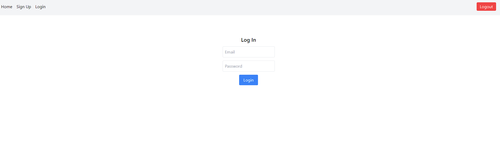
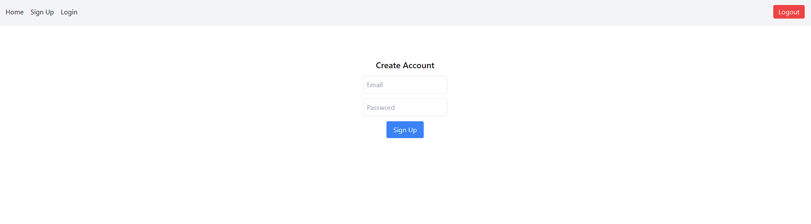
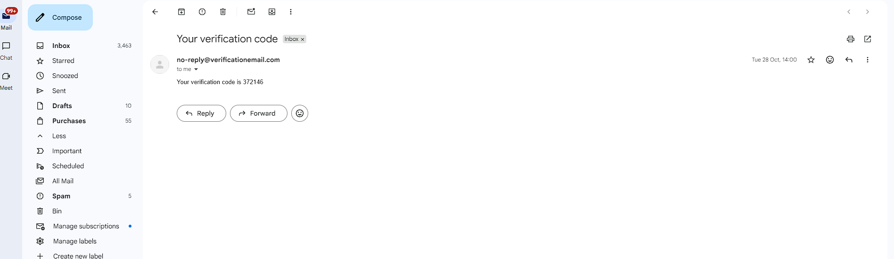
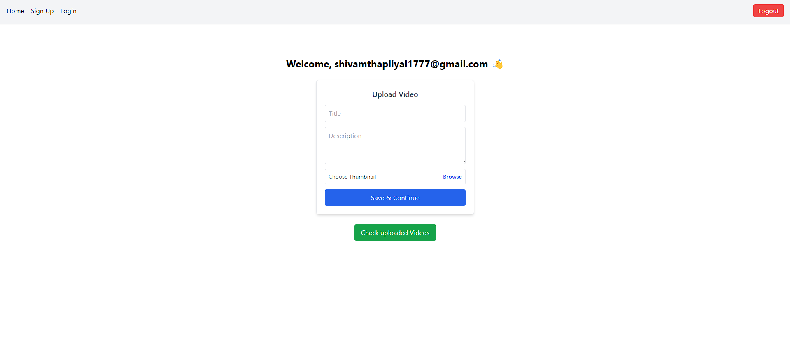
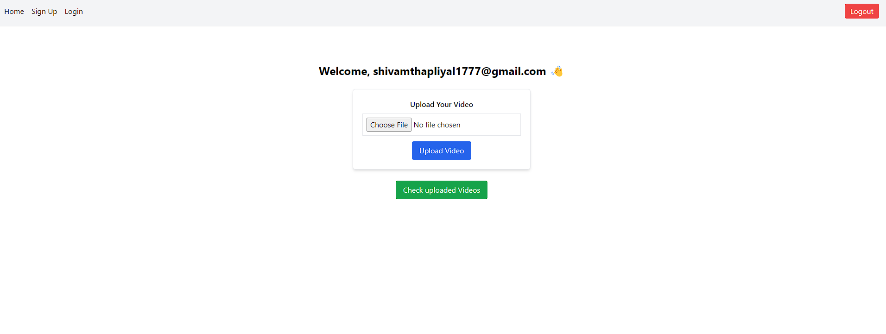
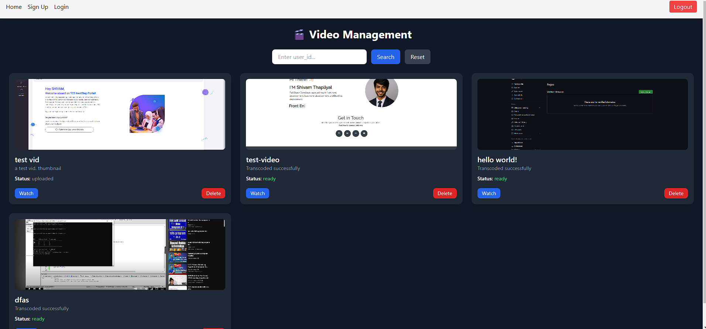
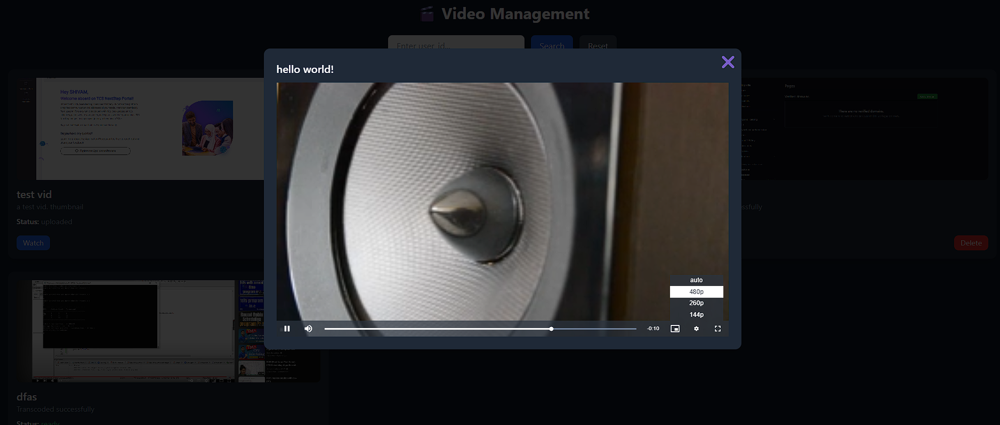

# 🎥 Microservice-Based Adaptive Bitrate Video Streaming Platform

A fully scalable **microservice-based video streaming platform** that supports:

- Large video uploads  
- Automatic transcoding into multiple resolutions  
- Event-driven processing with SQS  
- Adaptive HLS streaming based on bandwidth  
- Kubernetes deployment on AWS EKS  

This system processes videos asynchronously and streams them using HLS, automatically adjusting quality in real time.

---

# 🚀 Architecture & Features

## **1. Microservice Architecture**

Includes the following independent services:

- **Auth Service** – Sign up, login, verification with secure token handling  
- **Upload Service** – Handles video uploads & multipart S3 uploads  
- **Transcoding Service** – Converts videos to multiple resolutions (240p, 360p, 480p) using FFmpeg  
- **Streaming Service** – Serves HLS playlists and video segments (`.m3u8`)  
- **Notification/Callback Service** – Updates DB and users after processing  

---

## **2. Event-Driven Processing (SQS + S3)**

- Video upload → **S3 event trigger**  
- S3 pushes message into **SQS queue**  
- A worker pod pulls message → begins transcoding  
- Decoupled architecture → **scalable, fault-tolerant, high throughput**  

---

## **3. Kubernetes (EKS) Deployment**

- Autoscaling based on CPU usage or SQS queue depth  
- Each pod handles **one transcoding job**  
- NGINX Ingress Controller for routing  
- Pod-to-pod communication similar to a service mesh  

---

## **4. Adaptive Bitrate Streaming (HLS)**

- Player automatically selects best resolution  
- `.m3u8` master playlist supports multi-bitrate streaming  
- Ready for CDN distribution  

---

## **5. Authentication (AWS Cognito)**

- Secure token-based authentication  
- Role-based access  
- Email verification flow  

---

## **6. Storage Architecture**

- Raw uploads → **S3 Bucket**  
- Processed HLS segments → **HLS output folder in S3**  
- **MySQL** used to store:
  - Video metadata  
  - Processing status  
  - Playback links  

---

# 📸 Screenshots

## **🔐 Verification & Authentication**

---

## **⬆️ Upload Flow**

---

## **🎬 Player UI (Adaptive Streaming)**

